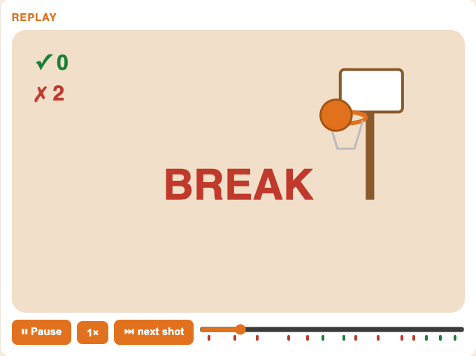
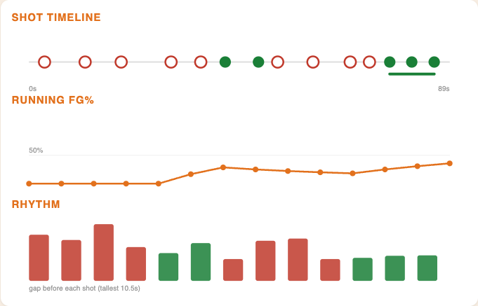
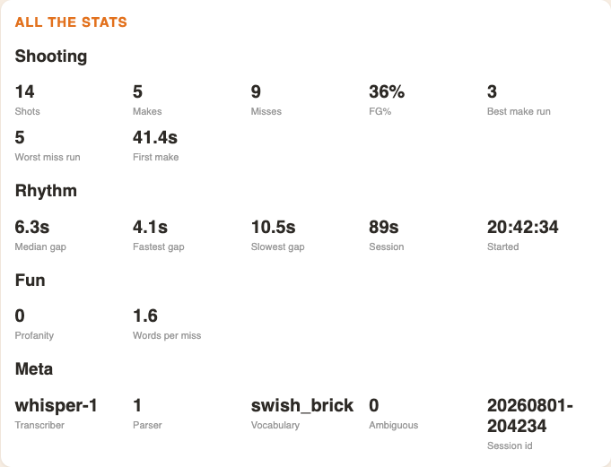

# 🏀 hoops — one-button voice logging, from jump shot to emailed report

[](https://github.com/guhandi/hoops/actions/workflows/ci.yml)
[](LICENSE)
[](pyproject.toml)

Press one button on your phone, shoot until you make three in a row, call out each shot as it happens, stop the recording. Two minutes later an interactive session report is in your inbox — audio-synced replay, shot charts, streaks — with zero further interaction.



*The report replays your session: your real audio drives an animated court — the ball lands on the actual impact sound detected in the audio, and your call-out fires the confirmation a beat later (calls with no audible impact get flagged 🤥).*

## Try it in 60 seconds — zero API keys

```bash
# needs uv (https://docs.astral.sh/uv): curl -LsSf https://astral.sh/uv/install.sh | sh
git clone https://github.com/guhandi/hoops && cd hoops
uv sync
uv run hoops process-all fixtures --no-email
open out/index.html    # Linux: xdg-open out/index.html
```

That runs the full pipeline — isolation-gated parsing, invariants, stats, interactive reports — over the committed golden dataset (real recordings + cached transcripts). No accounts, no keys, nothing to configure. `uv run hoops score` prints the accuracy gate table the same way.

|  |  |
|---|---|

## Purpose

This project exists to make **data acquisition as close to free as possible** for things you do every day with your hands busy.

The concrete instance: every morning I shoot at my basketball hoop until I make three in a row. It's a consistent, self-terminating daily protocol that produces a clean scalar (*shots to three-in-a-row*) — but logging it by hand would kill the habit. Hands are busy, it's 6am, and any friction means the logging stops.

Voice is the only capture channel that costs nothing: the call-outs ("make", "miss") happen naturally as part of the activity. An Apple Shortcut bound to one Home Screen button records the audio and drops it in iCloud. Everything after that — transcription, parsing, validation, stats, charting, reporting — is machine work that runs unattended in the cloud (Modal + R2), with a Mac-based fallback path.

At ~40 sessions the dataset becomes a real dependent variable: shots-to-three regressed against sleep, HRV, alcohol, late screens.

Basketball is instance #1. The capture pattern (one Shortcut, spoken vocabulary, a stop rule) generalizes to reps, sets, food logs, sprints — a second capture type is a config block and a duplicated Shortcut, not new code.

## How it works

```
[iPhone]  Apple Shortcut, one press
   └─ records audio → POST https://<modal-endpoint>/upload (raw upload + X-Hoops-Key)

[Modal endpoint]  auth + filename check + size cap + dedupe → instant ack
   └─ raw recording lands in R2 (Cloudflare object storage); processor spawned

[Modal processor]  (same pipeline core as ever, now running in the cloud)
   ├─ 1. Ingest      download raw from R2, dedupe
   ├─ 2. Transcribe  OpenAI whisper-1, word-level timestamps
   ├─ 3. Persist     full transcript JSON saved BEFORE parsing, uploaded to R2
   ├─ 4. Parse       isolation gating + vocabulary → shot calls (pure, deterministic)
   ├─ 5. Validate    invariants (e.g. session must end on exactly three straight makes)
   ├─ 6. Repair      only if invariants fail: LLM reconstructs the sequence, re-validated
   ├─ 7. Stats       shots-to-three, streaks, gaps, FG%
   ├─ 8. Listen      independent acoustic branch: HPSS impact detection, paired to calls at fusion (never informs parsing — calls stay clean training labels; 🤥 flags calls with no audible impact)
   ├─ 9. Render      shot-strip PNG + HTML report
   └─ 10. Email      report + every artifact attached (R2 is the source of truth; the emailed zip is the belt-and-suspenders copy)
```

Report email lands ~2 minutes after the tap — no iCloud sync wait. A local mode (Mac + launchd + iCloud drop folder, same pipeline core) is kept as a fallback; see [docs/architecture.md](docs/architecture.md) and [docs/shortcut-setup.md](docs/shortcut-setup.md).

**The spoken protocol** (all of it):

| You say | Meaning |
|---|---|
| `swish`, `splash`, or `make` | made shot |
| `brick`, `break`, or `miss` | missed shot |
| `scratch that` | void the previous call (misspoke) |
| `note: <anything>` | free-text note captured verbatim into the dataset |

That's the default `swish_brick` vocabulary; a stricter `make_miss` set (`make`/`miss` only) also ships in `config.yaml`. Either can be overridden per recording with a `<same-stem>.json` sidecar next to the audio (`{"vocabulary": "make_miss"}` or a custom `{"vocab_map": {...}}`), or one-off via `hoops process <path> --vocab NAME`.

Everything else you say — muttering, cussing, commentary — is ignored by the parser (and mined for the report's quote-of-the-day). The key trick is **isolation gating**: a real call-out is an isolated word surrounded by silence; the word "make" inside "come on, make it" sits in continuous speech and is discarded. This is what keeps commentary from creating phantom shots.

**Where AI is and isn't used:** transcription (whisper-1) and two narrow LLM jobs — repairing a sequence that violates the stop rule, and writing the email's three-sentence recap (heavily guardrailed: no numbers, no invented quotes, no comparisons). Everything load-bearing — parsing, stats, validation — is deterministic, pure-stdlib Python, and unit-tested.

## Daily use

1. Tap the Shortcut. Set the phone down. Shoot, calling out each shot.
2. Make three in a row → say `note: whatever context matters` if you want → stop the recording.
3. Read the email when it arrives. That's it.

Bad sessions never disappear silently: too-short recordings are rejected, sessions with no detected calls are set aside and emailed with the raw transcript, invariant failures ship *flagged* in the subject line rather than guessed at.

## Deploy your own (~15 minutes, all free-tier)

The primary deployment is serverless: your phone POSTs recordings to a [Modal](https://modal.com) endpoint, artifacts live in Cloudflare R2, reports arrive by email. Infra cost: $0/month; API cost ≈ 1¢/session.

**[→ docs/deploy-your-own.md](docs/deploy-your-own.md)** — accounts checklist, one `.env`, two commands, smoke test, phone Shortcut.

### Local fallback mode (macOS)

No cloud required: an Apple Shortcut drops recordings in iCloud Drive and a launchd job on your Mac polls and processes them. `bash scripts/install_launchd.sh` schedules it (generates `com.hoops.poller.plist` from your clone's path). Same pipeline, slower delivery (~5-10 min). See [docs/architecture.md](docs/architecture.md) for both paths.

`GMAIL_ADDRESS` overrides the `email.from`/`email.to` in `config.yaml` — set it if you don't want to edit the YAML directly.

**GuData push (optional):** with `gudata.enabled: true` in `config.yaml` and the three `GUDATA_*` vars set (see `.env.example`), each session's stats + per-shot rows are POSTed after Stats to GuData's `hoops_shooting` instrument. Failures never block the report email — they're flagged in it — and `hoops push --all` backfills the archive idempotently (the server dedupes on `external_id`).

**Troubleshooting:** confirm the poller is alive with `launchctl list com.hoops.poller` (status must be `0`); logs live in `logs/poll.log`.

## CLI

```
hoops process <path.m4a> [--no-email]      # one file, end to end
hoops process-all fixtures --no-email      # run the test-fixture set + visual gallery (out/index.html)
hoops replay [--all | <sid>]               # re-parse stored transcripts (free, no API)
hoops push [--all | <sid>]                 # push archived session(s) to GuData (idempotent)
hoops poll                                 # one-shot inbox scan (what launchd runs)
hoops score                                # accuracy gate table vs fixtures/manifest.csv
hoops transcribe-fixtures [--only <name>]  # refresh fixture transcripts (paid API call)
```

## Data layout

Every session is a self-contained folder — reprocessable from its own audio and nothing else:

```
sessions/                  (gitignored — local-only)
  2026/07/hoops__20260728-061204/
    audio.m4a          ground truth; the email attachment is its offsite copy
    transcript.json    full whisper response: words, timestamps, confidences
    transcript.txt     human-readable
    shots.csv          one row per shot: result, time, gap, streak, isolation, raw token
    session.json       session stats: shots_to_three, streaks, gaps, notes, flags
    report.html        the interactive report (emailed inside the session zip)
    strip.png          shot chart: filled = make, hollow = miss, spacing = rhythm
```

Fixtures and their transcripts are committed — that's the golden dataset. Per-session data (everything under `sessions/`) is fully gitignored and stays local-only; `scripts/build_db.py` rebuilds a disposable SQLite DB from local session CSVs whenever you want to query. No live database sits in the capture path.

## Accuracy and testing

- `fixtures/` holds labeled recordings; `fixtures/manifest.csv` is the single source of truth for expected call sequences.
- `hoops score` prints the gate table (call recall/precision ≥ 0.99, sequence exact-match ≥ 0.90, **zero** phantom shots on bait-word fixtures — a hard failure). `hoops score` writes its results back into `fixtures/manifest.csv` (the `heard_calls`/`got_calls`/`match`/`scored_at` columns) — that diff is intentional.
- The parser runs from stored transcripts, so `hoops replay --all` re-parses every archived session for free and `hoops score` re-scores every committed fixture transcript. Parser changes merge only after a no-op replay leaves session outputs byte-identical — `sessions/` isn't tracked in git, so snapshot the folder first and compare with `git diff --no-index` — and the score gates pass.
- `uv run pytest` — the full suite is offline and free; API-touching tests are opt-in (`-m paid`).

## Use this repo as a template

hoops doubles as my worked example of building an AI-automated personal
tool: spec-first design, a golden labeled dataset before capability,
score gates instead of demos, and an assistant working agreement
(CLAUDE.md) that stays truthful. The process, with links to every real
artifact here, is written down in [docs/playbook.md](docs/playbook.md).

Reading path: this README → [docs/playbook.md](docs/playbook.md) →
[docs/architecture.md](docs/architecture.md) →
[docs/methodology.md](docs/methodology.md) →
[docs/pattern/README.md](docs/pattern/README.md).

Deeper docs: [docs/playbook.md](docs/playbook.md) · [docs/architecture.md](docs/architecture.md) · design spec: [docs/specs/2026-07-27-hoops-voice-log-design.md](docs/specs/2026-07-27-hoops-voice-log-design.md) · original PRD (archived): [docs/archive/PRD-hoops-voice-log.md](docs/archive/PRD-hoops-voice-log.md)

## Adding a second capture type later

The inbox is shared: every Shortcut writes `<type>__<timestamp>.m4a` into the same folder, and the poller routes by prefix. Adding "food" or "workout" logging is: duplicate the Shortcut with a new prefix, add a vocabulary block to `config.yaml`. One watcher, one code path.
